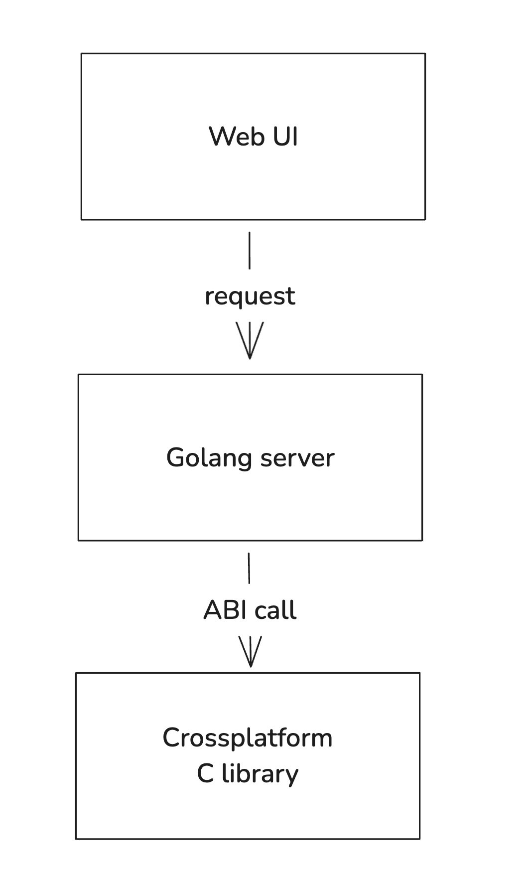
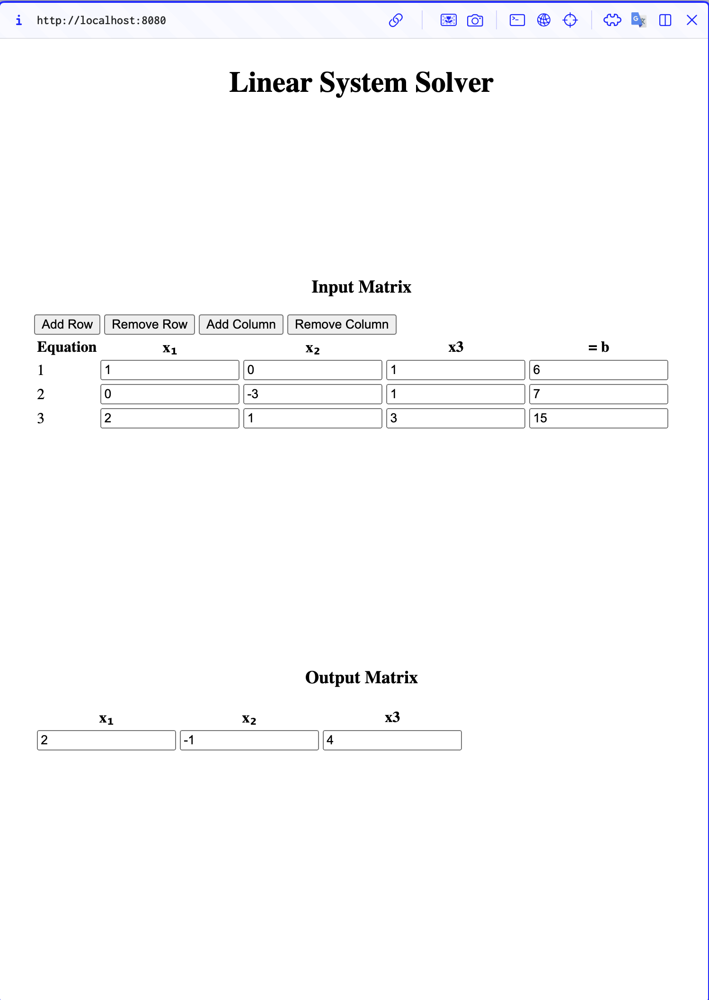

## Crossplatform usage of compiled C library with golang and web client


> The project domain is solving linear systems of equations. Currently implemented only matrix method. 


- Lab is adaptation of lab1 with web client
- Golang currently used as http server, covered by unit tests
- Webserver servers static files and provides linear system solving api
- Web client is implemented with vanilla js
- The lab reused compiled C library from lab1
- Supported platforms:
  - `darwin-arm64`
  - `linux-arm64`
  - `linux-amd64`


## Testing
**Run tests of webserver and library**
The script should detect your platform and run version for it.
```
# In root directory
./test.sh
```

To run tests on another supported platform run:
```
./test.sh <platform>
```

## Running
**Run webserver**
The script should detect your platform and run version for it.
```
# In root directory
./run.sh
```

To run webserver on another supported platform run:
```
./run.sh <platform>
```

### Architecture


### WebUI

