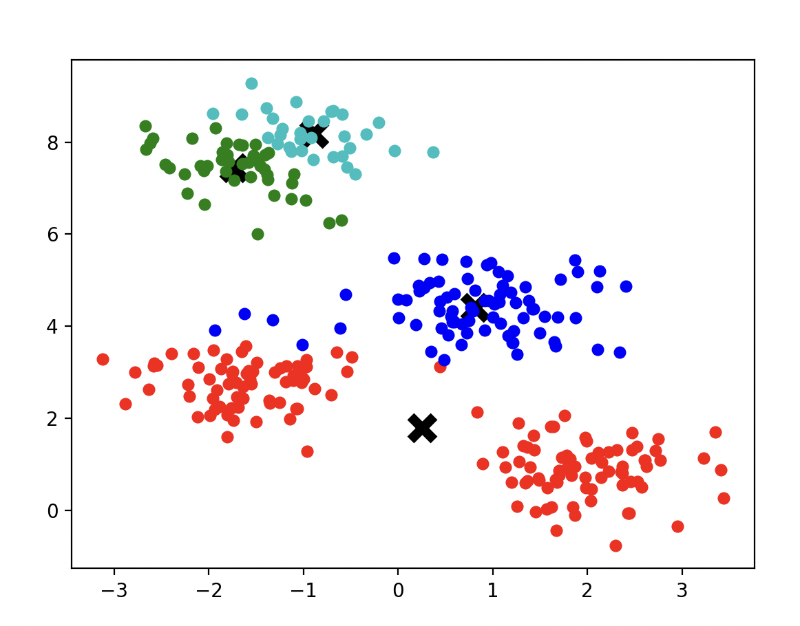
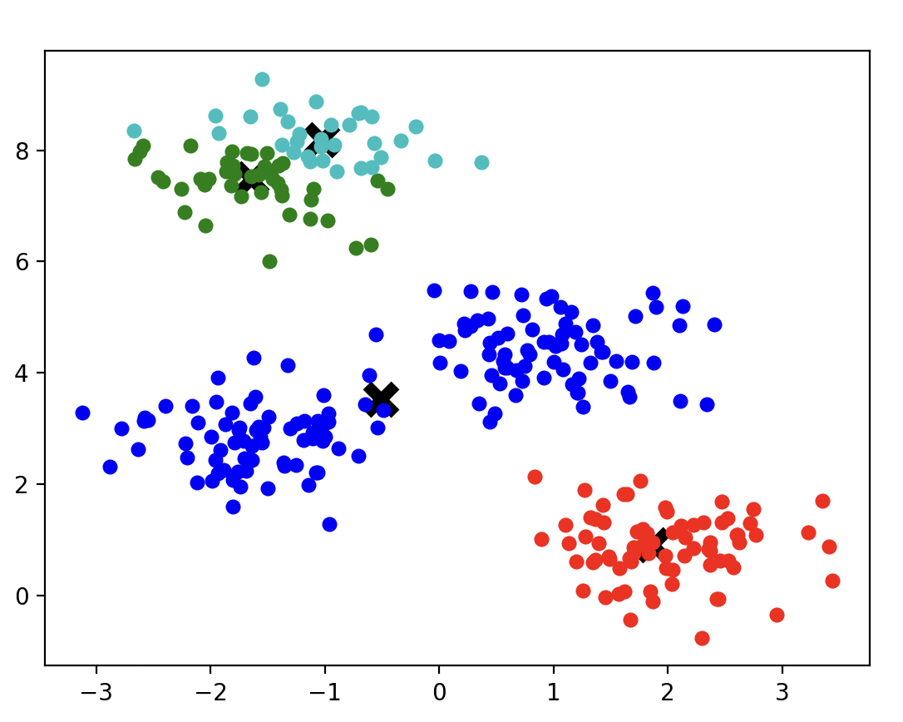

# Lab2 report
1 Реалізувати програмно алгоритм Апріорі для пошуку асоціативних правил (додаткове завдання реалізувати також алгоритм FP-Growth)
Тестові набори даних можна знайти в посібнику з практичних.
2 Реалізувати програмно алгоритми кластеризації - k-Means, k-Medians, ієрархічні алгоритми, алгоритм найближчого сусіда, DBSCAN

## Апріорі
The Apriori algorithm is a classic method used in data mining to find frequent itemsets and generate association rules. It operates by identifying the most frequent individual items in the dataset and extending them to larger itemsets as long as those itemsets appear sufficiently often in the dataset.

The implemented steps:
- Data Preparation: The dataset is converted into a list of transactions, where each transaction is a set of items.
- Candidate Generation: For each iteration, candidate itemsets are generated by combining frequent itemsets from the previous iteration.
- Support Calculation: The support of each candidate itemset is calculated, and itemsets that meet the minimum support threshold are retained.
- Frequent Itemsets: The process is repeated until no more candidate itemsets can be generated.
- Rule Generation: For each frequent itemset, all possible rules are generated, and their confidence is calculated. Rules that meet the minimum confidence threshold are kept.

The algorithm evaluated on set:
```python
data = [['milk', 'bread', 'butter'],
        ['beer', 'bread'],
        ['milk', 'bread', 'beer', 'butter'],
        ['bread', 'butter'],
        ['milk', 'bread', 'butter']]

min_support = 0.5
min_confidence = 0.7
```

The output is: 
```
Rule: {'bread'} -> {'butter'}, support: 0.8, confidence: 0.8
Rule: {'butter'} -> {'bread'}, support: 0.8, confidence: 1.0
Rule: {'milk'} -> {'bread'}, support: 0.6, confidence: 1.0
Rule: {'butter'} -> {'milk'}, support: 0.6, confidence: 0.7499999999999999
Rule: {'milk'} -> {'butter'}, support: 0.6, confidence: 1.0
Rule: {'butter'} -> {'bread', 'milk'}, support: 0.6, confidence: 0.7499999999999999
Rule: {'milk'} -> {'bread', 'butter'}, support: 0.6, confidence: 1.0
Rule: {'bread', 'butter'} -> {'milk'}, support: 0.6, confidence: 0.7499999999999999
Rule: {'bread', 'milk'} -> {'butter'}, support: 0.6, confidence: 1.0
Rule: {'butter', 'milk'} -> {'bread'}, support: 0.6, confidence: 1.0
```

## K Means

The k-Means clustering algorithm is an iterative method used to partition a dataset into k distinct, non-overlapping subsets (clusters). The goal is to minimize the variance within each cluster.

Implementation Steps
- Initialization: Set the number of clusters k. Initialize the centroids by selecting the first k points from the dataset.
- Assignment: Assign each data point to the nearest centroid based on Euclidean distance.
- Update: Recalculate the centroids as the mean of all points assigned to each centroid.
Convergence: Repeat the assignment and update steps until the centroids do not significantly change, i.e., the change in centroids is below a defined tolerance tol.
Prediction: Assign new data points to the nearest centroid.

The dataset is generated using make_blobs with 300 samples, 4 centers with cluster_std 0.60.
The result of clusterization: 



## K Medians

The k-Medians clustering algorithm is an iterative method used to partition a dataset into k distinct, non-overlapping subsets (clusters). Unlike k-Means, which uses the mean, k-Medians uses the median to update the centroids, making it more robust to outliers.

Implementation Steps
- Initialization: Set the number of clusters k. Initialize the medians by selecting the first k points from the dataset.
- Assignment: Assign each data point to the nearest median based on Manhattan distance (L1 norm).
Update: Recalculate the medians as the median of all points assigned to each centroid.
- Convergence Check: Repeat the assignment and update steps until the medians do not significantly change, i.e., the change in medians is below a defined tolerance tol.
- Prediction: Assign new data points to the nearest median.

The dataset is generated using make_blobs with 300 samples, 4 centers with cluster_std 0.60.
The result of clusterization: 

