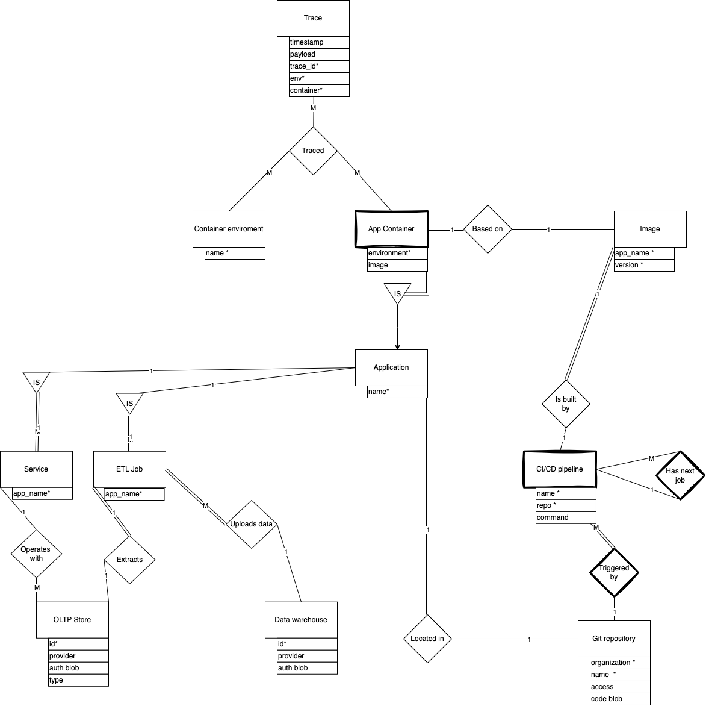

# Entity relationship diagram

_Simple cloud native application ontology._

## Description

### Application

- Application - generic type of program.

- Service - is an Application, designed to run as a server. **Can** use oltp store.

- ETL job - is an Application, designed to run as a daemon to process data(streaming or batching). **Must** extract data from one oltp storage, process it and upload to data warehouse.

- OLTP storage - generic type of OLTP storage, can have type of:
  1. database(cockroachDB, postgreSQL, etc.) which should be used for instant domain operations
  2. message broker(kafka, nats, rabbitMQ, etc.).

### Code management

- Git repository - entity where application code is located, one repository must have only one application - it's a rule to control complexity.

- CI/CD pipeline - job, triggered by interval or changes in Git repository. Pipeline can trigger other pipelines, even in different repo's(so has relationship with itself).
  > CI/CD pipeline is weak entity, it primary key is composite and contains repo_id.

### Delivery

- Container environment - system for automating software deployment, scaling, and management.

- App container - subtype of application(is a). Represents running container from [OCI](https://opencontainers.org/), runs on **Container environment**. Sometimes it's necessary to run application replica on different environments. Uses image artifact to bootstrap.

  > App container is a weak entity, as it primary key depends of app_name and environment_name.

- Image - represents image from [OCI](https://opencontainers.org/). Just an application gathered with all deps. Built by CI/CD pipeline.
  > Image is a weak entity, because primary key consist of external app_name and internal version.

### Tracing

- Trace - is a distributed log of data, produced by multiple containers at multiple environments, connected by trace_id.
  It's necessary to accurately determine from which container and environment trace comes.

Since there are no mapping from "App container" to "Container environment" and one trace can engage "App containers" from different "Container environments" - Trace has ternary relation with both "App containers" and "Container environments".
`(container_id, env_id, trace_id)`

> Why not just a few binary?

Let's assume that we have next relationships. (env, trace_id) and (container, trace_id) - The "trace fact" is stored in two tables which leads to violation of data integrity.
So we need entity, than can combine env and container to make composite primary key.
