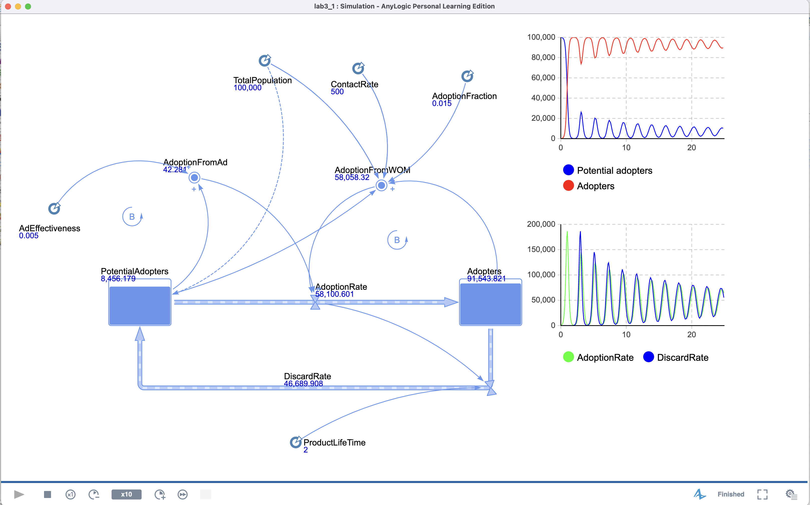
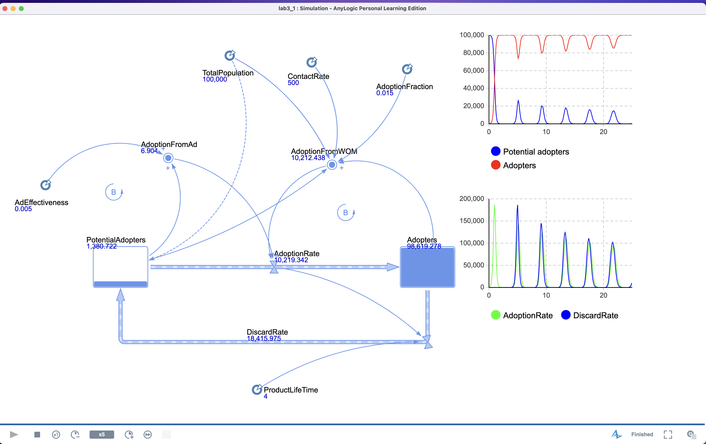
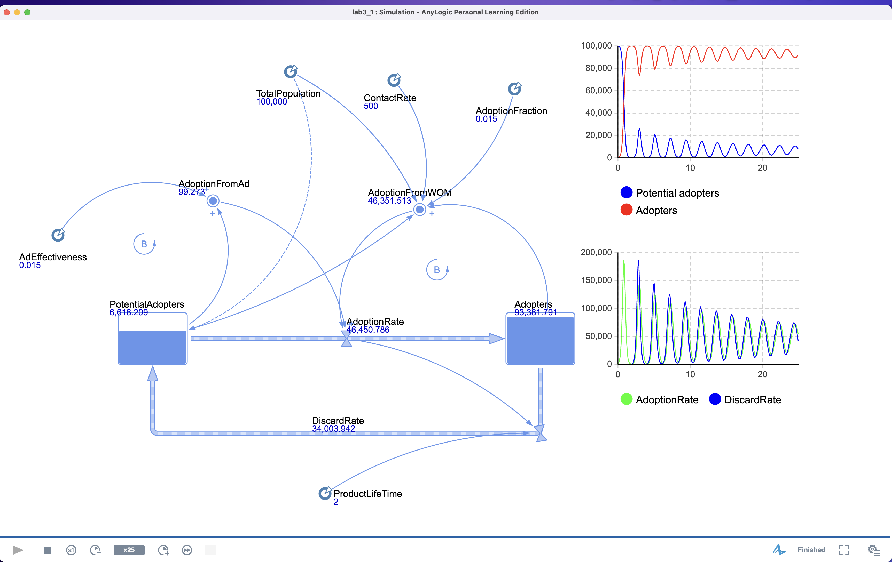
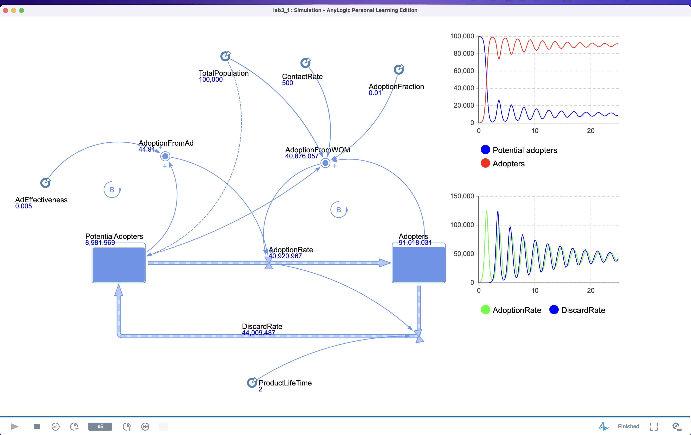
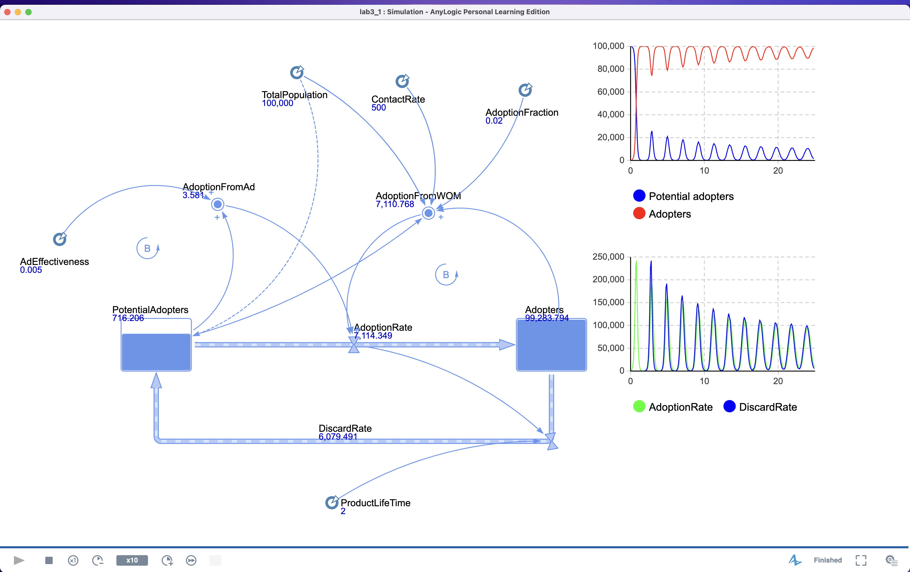
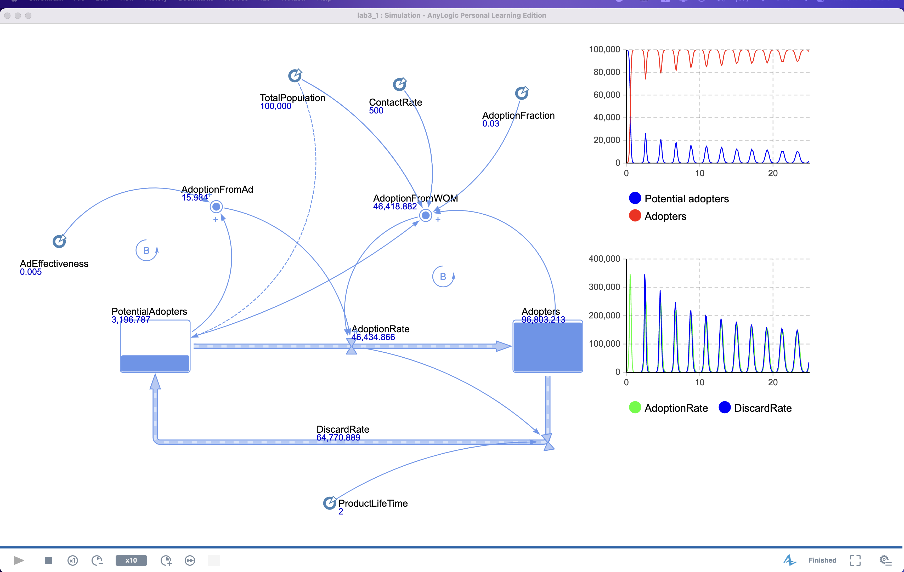

# Lab3 Variant 1

| Meetings count | intervals | AdEfficacy          | ConversationEfficacy |
| -------------- | --------- | ------------------- | -------------------- |
| 500            | 2;4       | 0.005; 0.01; 0.015; | 0.01; 0.02; 0.03;    |

# Intervals comparing

By default:

- AdEfficacy=0.005
- time = 25 points
- ConversationEfficacy = 0.015

## 2

## 4

The potential adopters spikes are more smooth when product lifetime is shorter because of less time required to distribute product over time after first launch. Also, the apotion and discard rates have bigger oscillations at the start, but due to the distribution over time tend to be constant.

# AdEfficacy comparing

By default:

- Intervals = 2
- time = 25 points
- ConversationEfficacy = 0.015

## 0.005

## 0.01

## 0.015

The marketing efficacies are have relevant effect on the product launch time, when adoption from word of mouth(WOM) is zero.

# ConversationEfficacy comparing

By default:

- Intervals = 2
- AdEfficacy = 0.005
- time = 25 points

## 0.01

## 0.02

## 0.03

When AdoptionRate is accelerated - the adoption curve becomes steeper, reaching its peak faster.