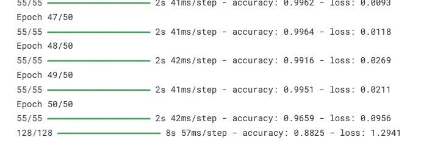
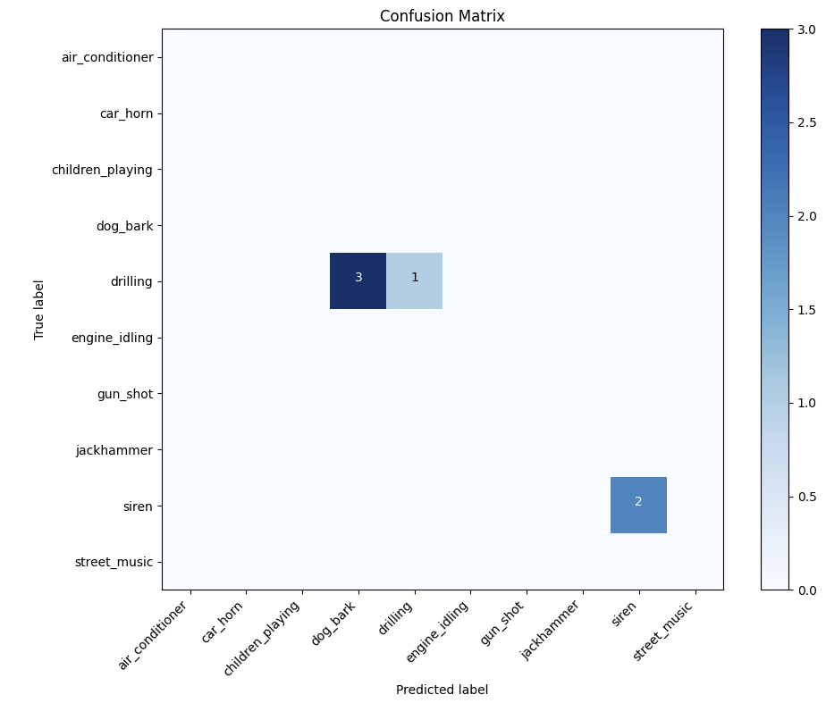

# UrbanSound8k sound classification

Completed by Serhii Syrota

## Model architecture

```python
model = keras.Sequential([
            keras.layers.Conv2D(32, (12, 12), activation='relu', input_shape=self.input_shape),
            keras.layers.MaxPooling2D((8, 8)),
            keras.layers.Conv2D(64, (3, 3), activation='relu'),
            keras.layers.MaxPooling2D((2, 2)),
            keras.layers.Conv2D(128, (3, 3), activation='relu'),
            keras.layers.MaxPooling2D((2, 2)),
            keras.layers.Flatten(),
            keras.layers.Dense(128, activation='relu'),
            keras.layers.Dropout(0.1),
            keras.layers.Dense(self.num_classes, activation='softmax')
        ])
        model.compile(optimizer='adam',
                      loss='categorical_crossentropy',
                      metrics=['accuracy'])
```

The generated images has size 256x256, but the size can be reduced to 64x64(with network first layer tuning) without accuracy loss.

## Results



## Real data confusion


