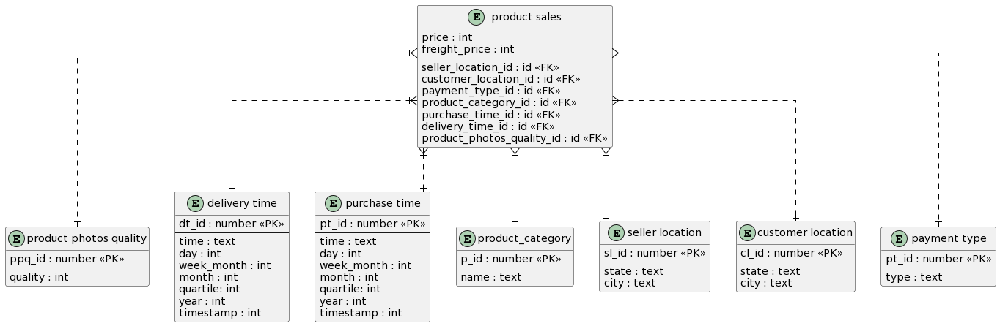
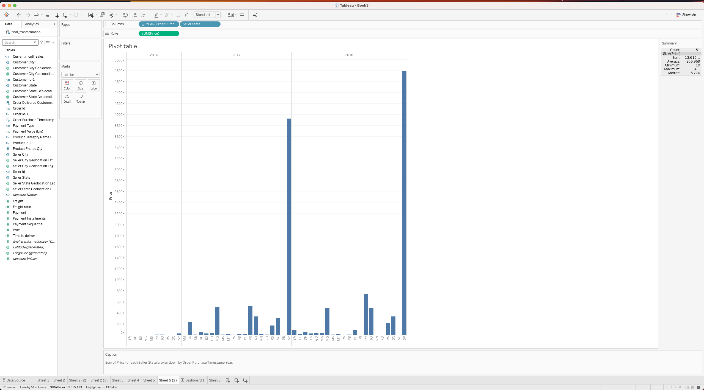
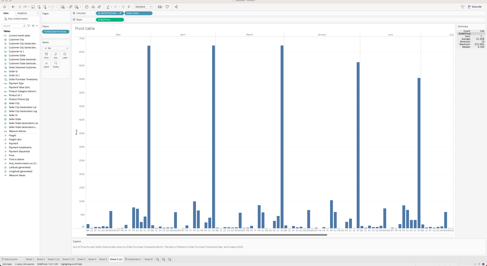
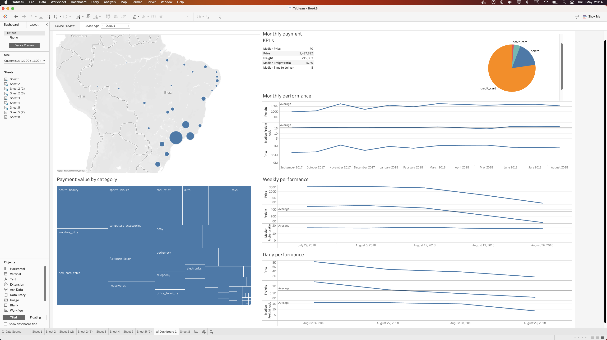

# Task 1

## 1.1 предметна галузь та використаний набір даних – короткий опис

Предметна область - бразильський e-commerce датасет продажів товарів магазину Olist Store. Датасет має приблизно 100 тисяч замовлень у проміжку з 2016 до 2018 року. У датасеті представлені анонімні дані покупців та продавців разом з їх місцезнаходженням. Аналіз в лабараторній роботі робився з точки зору продажів продуктів, де фактом був проданий товар, а не замовлення. Такий підхід дозволив з більшою точністю проаналізувати вподобання споживачів щодо категорій окремих продуктів та окремих продавців.
На ETL етапі була відсіяна частина замовлень, в яких не було оплат, або які були повернуті. Враховуються лише "успішні" замовлення.

Посилання на набір даних - <https://www.kaggle.com/datasets/olistbr/brazilian-ecommerce?select=olist_order_payments_dataset.csv>

## 1.2 зіркова схема даних, опис вимірів, ієрархій, та мір

Зіркова схема була розроблена за допомогою [plantuml](https://plantuml.com/), сервісу, який має функціонал генерації uml діаграм з тексту. 
<details>
<summary>Код діаграми</summary>

```
@startuml

' hide the spot
' hide circle

' avoid problems with angled crows feet
skinparam linetype ortho

entity "product sales" as product_sales {
  price : int
  freight_price : int
  --
  seller_location_id : id <<FK>>
  customer_location_id : id <<FK>>
  payment_type_id : id <<FK>>
  product_category_id : id <<FK>>
  purchase_time_id : id <<FK>>
  delivery_time_id : id <<FK>>
  product_photos_quality_id : id <<FK>>
}


entity "product photos quality" as product_photos_quality {
  ppq_id : number <<PK>>
  --
  quality : int
}

entity "delivery time" as delivery_time {
  dt_id : number <<PK>>
  --
  time : text
  day : int
  week_month : int
  month : int
  quartile: int
  year : int
  timestamp : int 
}
entity "purchase time" as purchase_time {
  pt_id : number <<PK>>
  --
  time : text
  day : int
  week_month : int
  month : int
  quartile: int
  year : int
  timestamp : int 
}

entity "product_category" as product_category {
  p_id : number <<PK>>
  --
  name : text
}
entity "seller location" as seller_location {
  sl_id : number <<PK>>
  --
  state : text
  city : text
}

entity "customer location" as customer_location {
  cl_id : number <<PK>>
  --
  state : text
  city : text
}

entity "payment type" as payment_type {
  pt_id : number <<PK>>
  --
  type : text
}


product_sales }|..|| seller_location
product_sales }|..|| customer_location
product_sales }|..|| payment_type
product_sales }|..|| product_category
product_sales }|..|| product_photos_quality
product_sales }|..|| purchase_time
product_sales }|..|| delivery_time
@enduml
```

</details>

### Виміри

1. Product photo quantity - кількість фотографій продукту на сторінці продажу. 
2. Delivery time - зліпок часу доставки до клієнту, є 5 рівневою ієрархією.
3. Purchase time - зліпок часу покупки клієнтом, є 5 рівневою ієрархією.
4. Product category - категорія продукту.
5. Seller location - локація продавця, ієрархія 2 рівнева(штат, місто)
6. Customer location - локація покупця, ієрархія 2 рівнева(штат, місто)
7. Payment type - тип оплати, кредитка, місцева boleto, тощо.

### Міри

Фактом є продаж продукту
1. Price - ціна проданого продукту(варто зазначити, що у різний час ціна може бути різна)
2. Freight value - ціна доставки.

### Pivot таблиця обʼєму покупок по рокам на перетені зі штатом покупця



### Pivot таблиця drill down по місяцям останнього року на перетені зі штатом покупця по обʼєму покупок




# Task 2


Короткий опис:
1. Нагорі зліва - обʼєм продажів за штатом покупців
2. Внизу зліва - обʼєм продажів за категорією продукту
3. Нагорі зправа - обʼєм продажів за типом оплати
4. Нагорі по центру - таблиця KPI за місяць
5. Центр справа - sparklines table для KPI за тижнями, місяцями, днями. Основні метрики - ціна продажу, ціна доставки та медіанне відношення доставки до ціни.


Dashboard - з повною підтримкою фільтрації при натисканні.

Приклад фільтрації за штатом покупців Sao Paulo([штат, в якому в місті Sao Paulo заборонили зовнішню візуальну рекламу](https://99percentinvisible.org/article/clean-city-law-secrets-sao-paulo-uncovered-outdoor-advertising-ban/)):
